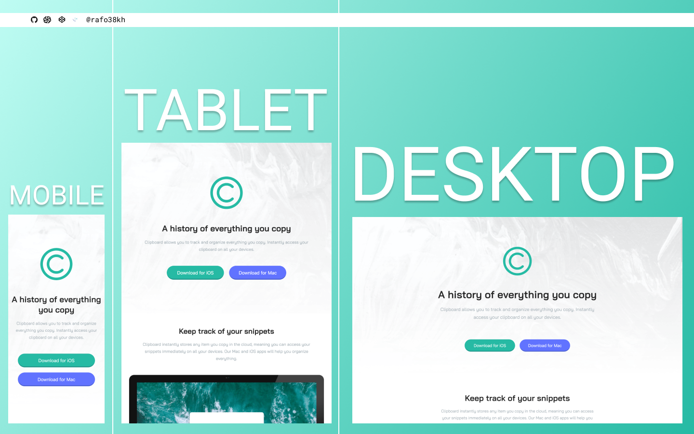

# Frontend Mentor - Clipboard Landing Page Solution

This is a solution to the [Clipboard Landing Page Challenge on Frontend Mentor](https://www.frontendmentor.io/challenges/clipboard-landing-page-5cc9bccd6c4c91111378ecb9)

## Table of contents

- [Overview](#overview)
  - [The challenge](#the-challenge)
  - [Screenshot](#screenshot)
  - [Links](#links)
- [My process](#my-process)
  - [Built with](#built-with)
- [Author](#author)

## Overview

### The challenge

- View the optimal layout for the site depending on their device's screen size
- See hover states for all interactive elements on the page

### Screenshot

### Links

- Solution URL: [https://www.frontendmentor.io/solutions/clipboard-landing-page-with-bem-css-grid-and-flexbox-WdnKZIUaS](https://www.frontendmentor.io/solutions/clipboard-landing-page-with-bem-css-grid-and-flexbox-WdnKZIUaS)
- Live Site URL: [https://rafo38kh.github.io/clipboard-landing-page/](https://rafo38kh.github.io/clipboard-landing-page/)

## My process

### Built with

- Semantic HTML5 markup
- SCSS custom properties
- CSS Flexbox
- CSS Grid
- Mobile-first workflow

## Author

- Frontend Mentor - [@rafo38kh](https://www.frontendmentor.io/profile/rafo38kh)
- GitHub - [@rafo38kh](https://github.com/rafo38kh)
- Codewars - [@rafo38kh](https://www.codewars.com/users/rafo38kh)
